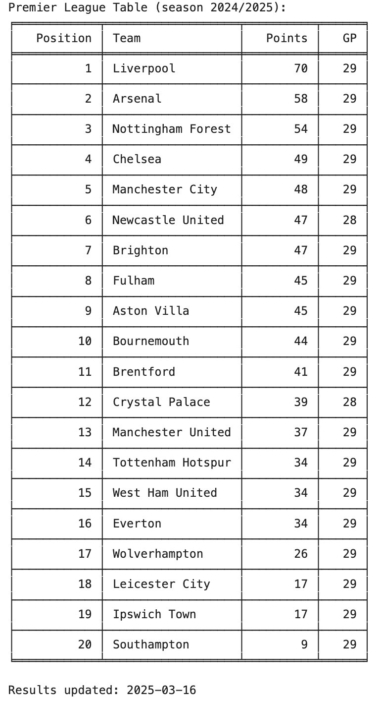

# premier-league-table
A Python script that processes Premier League match results from a CSV dataset and generates a live league table based on points. It also identifies the latest match date, tracks games played (GP), and presents the results in a formatted table.

Results are updated automatically from https://www.transfermarkt.co.uk/ once a week. Dataset source: https://www.kaggle.com/datasets/davidcariboo/player-scores?select=clubs.csv

Example output:

